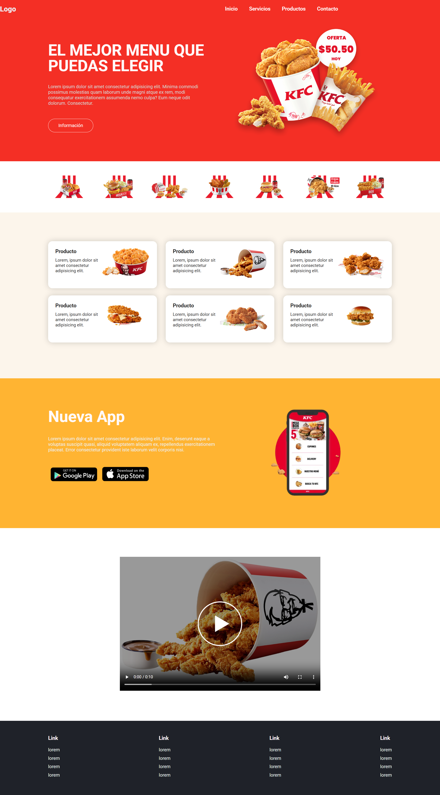

# Página Web - Menú Interactivo 🍽️

Sitio web responsivo creado como proyecto de práctica.  
La página está diseñada como un menú digital para un restaurante de comida rápida, con varias secciones informativas, productos destacados, una sección de app móvil y contenido multimedia.

## 🌐 Tecnologías usadas

- HTML5
- CSS3
- Responsive Design
- Fuentes de Google Fonts
- Imágenes y video local

## 📱 Características principales

- Menú de navegación adaptable a móviles
- Galería de productos estilo cards
- Sección promocional de app
- Video integrado con poster
- Footer con enlaces informativos
  
## 📸 Vista previa

Incluye un menú principal, secciones de productos, una presentación de una app, y un video.

 
 
